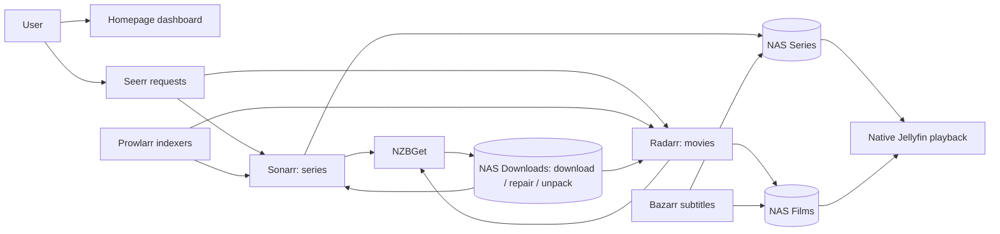

# Media stack · Mac compute, NAS storage

A documented, **secret-free configuration reference** for a macOS media stack: Jellyfin, Sonarr, Radarr, Prowlarr, NZBGet, Bazarr, Seerr, and Homepage.

The Mac runs the applications. The NAS holds the large downloads and media. Small databases, queue state, and logs belong on the Mac—not on SMB.

> **This is configuration, not a backup of the running installation.** There are no databases, accounts, passwords, API keys, downloaded files, viewing history, or library inventories here. Preference snapshots are references for the applications' settings screens, not universal one-click imports. Publishing this repository does not alter the live stack.

## What runs where?

| Service | Purpose | Runtime | Local UI |
|---|---|---|---|
| [Homepage](docs/services.md#homepage) | Dashboard and service status | Docker | [3000](http://localhost:3000) |
| [Seerr](docs/services.md#seerr) | Discover and request media | Docker | [5055](http://localhost:5055) |
| [Sonarr](docs/services.md#sonarr) | Series monitoring, naming, imports | Docker | [8989](http://localhost:8989) |
| [Radarr](docs/services.md#radarr) | Movie monitoring, naming, imports | Docker | [7878](http://localhost:7878) |
| [Prowlarr](docs/services.md#prowlarr) | Shared indexer management | Docker | [9696](http://localhost:9696) |
| [NZBGet](docs/services.md#nzbget) | Usenet downloading, repair, unpacking | Docker | [6789](http://localhost:6789) |
| [Bazarr](docs/services.md#bazarr) | Subtitle discovery and management | Docker | [6767](http://localhost:6767) |
| [Jellyfin](docs/services.md#jellyfin) | Library browsing and playback | Native macOS app | [8096](http://localhost:8096) |

The reference installation uses **OrbStack**, SMB NAS shares, French UI/metadata preferences, and `Europe/Paris` time. Docker Desktop can also run the Compose services; its filesystem performance may differ. Jellyfin is intentionally not a container in this design.

An external Plex server is an optional existing integration, **not deployed here**. The captured Seerr/Bazarr preferences retain their existing Plex-oriented choices; see the service guide before choosing Plex or Jellyfin on a fresh setup.

## Architecture at a glance



Arrows show the logical workflow, not every API request. For container DNS, storage paths, imports, native services, and trade-offs, read [Architecture](docs/architecture.md).

## Repository layout

```text
compose.yml                  Seven active container services; loopback-only ports
.env.example                 Non-secret local deployment variables
config/homepage/             Dashboard layout, links, widget placeholders
preferences/                 Allowlisted settings snapshots; not live app configs
  sonarr.json / radarr.json   Naming, profiles, size limits, client preferences
  prowlarr.json              Application sync settings; no private indexers
  bazarr.json                Subtitle settings and language profiles
  seerr.json                 Request preferences and target profile names
  nzbget.conf                Small preference overlay; no credentials
  jellyfin/*.xml             Selected settings only, not complete restore files
scripts/mount_shares.py       macOS Keychain-backed SMB mount helper
scripts/test_mount_shares.py  Offline mount-safety checks
scripts/check_public.py      Public-tree/credential-pattern checks
docs/                        Architecture, service guide, operations, security
```

Local-only directories are deliberately ignored: `runtime/`, `secrets/`, `backups/`, `nas/`, and `.env`.

## Quick start

**Do not point a second instance at an existing live application's database.** To reuse an installation, migrate it deliberately while stopped. For a fresh deployment:

1. Install Git, Python 3, OrbStack (or Docker Desktop), and the native Jellyfin application. Start the Docker engine.
2. Clone this repository and copy the environment example:
   ```sh
   git clone https://github.com/kherembourg/media-stack-config.git
   cd media-stack-config
   cp .env.example .env
   ```
3. Edit `.env` privately. Set `MEDIA_ROOT` to an absolute local mount directory, `NAS_HOST` to your NAS hostname/address, and `NAS_USER` to your NAS account. Check `id -u` / `id -g` for `PUID` / `PGID`. Reserve the NAS address if using an IP.
4. Connect to that **exact hostname/address** once in Finder (`Go → Connect to Server`), authenticate, and save the password to macOS Keychain. Disconnect Finder's temporary share mounts before using the helper, so the required shares can mount at `MEDIA_ROOT`.
5. Load your trusted local variables and mount the shares:
   ```sh
   # .env is a trusted shell-compatible local file, not an untrusted download.
   set -a
   . ./.env
   set +a
   python3 scripts/mount_shares.py "$NAS_HOST" "$NAS_USER" "$MEDIA_ROOT"
   ```
   Use quoted paths if they contain spaces. The NAS must provide `Downloads`, `Films`, and `Series` shares. The helper refuses to hide files already written into an unmounted directory.
6. Prepare private dashboard credential files, initially empty:
   ```sh
   mkdir -p secrets/homepage
   chmod 700 secrets secrets/homepage
   for name in sonarr_key radarr_key prowlarr_key bazarr_key seerr_key nzbget_user nzbget_pass; do
     (umask 077; touch "secrets/homepage/$name")
   done
   ```
7. Validate, then start the applications **only after the mounts succeeded**:
   ```sh
   docker compose config --quiet
   docker compose up -d
   ```
8. Complete each application's first-run setup and set unique credentials. Wire the services using the [connection table](docs/architecture.md#service-connections). Apply the preferences through their settings screens. NZBGet's `.conf` is a partial overlay; **do not replace its full configuration with it**.
9. Populate the private Homepage secret files with the generated app API keys and NZBGet UI credentials, then restart Homepage. Configure native Jellyfin and its libraries separately.

If importing an old installation, consult [Operations and recovery](docs/operations.md) first. The templates do not create media libraries or import an old queue automatically.

## Important defaults and deliberate differences

- **Large files never need to fit on the Mac.** Download, repair, temporary article storage, and unpacking paths stay on NAS storage.
- **NZBGet queue/history and logs are local.** `/config/queue` and `/config/logs` reside in the Mac's persistent `runtime/nzbget` directory.
- NZBGet has a **256 MB RAM article cache**, a **1,024 KB per-connection write buffer**, and three-day rotating logs.
- Compose web ports bind to **127.0.0.1**, safer than the original all-interface bindings. Native Jellyfin's listener is configured separately.
- The public NZBGet overlay enables strict TLS certificate verification rather than retaining the live snapshot's minimal verification. This changes only the template, not the running service.
- Use service names (`nzbget`, `sonarr`, etc.) between containers—not `localhost`.
- The dashboard uses file-backed secrets, never keys committed into YAML.
- Metadata language is French / France. Seerr's existing streaming-region preference is **US**, not France; snapshots preserve the actual setting.
- Jellyfin's captured `HardwareAccelerationType` is **`none`**. The native runtime allows testing VideoToolbox later; this repository does not pretend it is already enabled.
- The native mount helper retrieves credentials through macOS NetFS/Keychain; it does not save a password in a script or command line.
- Image tags currently follow `latest`, matching the installation. Pin digests for reproducible deployments and review upgrades.

## Documentation

- [Architecture](docs/architecture.md): data flow, storage, networking, native vs container choices.
- [Service guide](docs/services.md): purpose, setup, day-to-day usage, preferences, troubleshooting for every service.
- [Operations](docs/operations.md): mounts, startup, automatic remounts, backups, upgrades, migration, diagnostics.
- [Security and publication](docs/security.md): secrets, excluded data, safe Git workflow, recovery from accidental exposure.
- [Preference snapshots](preferences/README.md): what was exported and how to apply it.

## Check before committing

```sh
python3 scripts/test_mount_shares.py
python3 scripts/check_public.py
docker compose --env-file .env.example config --quiet
git diff --cached
```

The public-tree check catches common credential patterns, personal paths, private IP addresses, and unexpected file types. It is **not proof that a file contains no secrets**: manually review additions and never force-add ignored live configuration.

This stack is intended for media you are entitled to access. No indexer accounts or content inventories are distributed.
